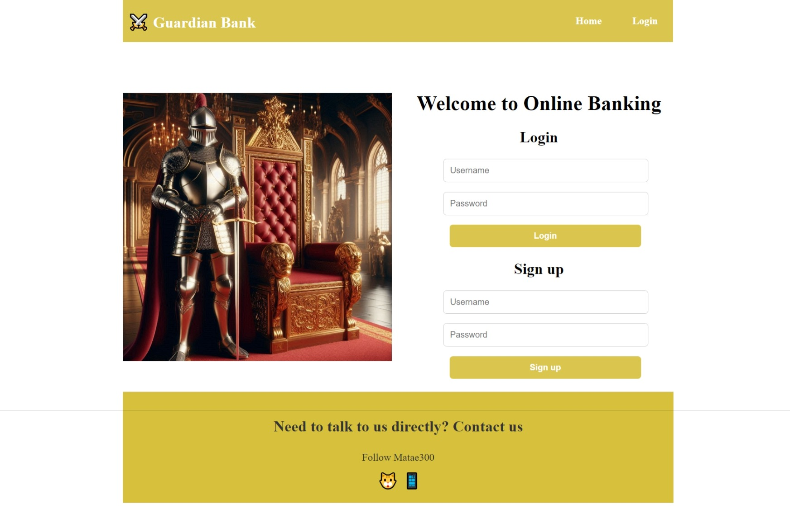

# Guardian Bank

## Description
Guardian Bank is a fake bank application created for demonstration purposes on a resume. The application features a web application built with a Django backend and a React frontend, utilizing JWT (JSON Web Token) authentication for secure user authentication and authorization.

## Technologies Used
- Django: Backend framework for handling data models, business logic, and API endpoints.
- React: Frontend library for building dynamic user interfaces and components.
- JWT Authentication: Ensures secure user authentication and authorization.
- HTML/CSS: Used for structuring and styling the user interface.
- PostgreSQL: Database management system for storing application data.
- Django REST Framework: Used for building RESTful APIs in the Django backend.
- React Router: Provides routing capabilities in the React frontend for navigation.
- Git/GitHub: Version control and collaboration platform for project development.
- VS Code: Integrated development environment for coding and debugging.

## Features
- User Registration and Authentication: Users can register for an account and securely log in using JWT authentication.
- Account Management: Users can view their account details, including balance and transaction history.
- Transfer Funds: Users can transfer funds between their own accounts or to other users within the bank.
- Secure Transactions: All transactions are secured using JWT authentication to ensure data privacy and integrity.
- Responsive Design: The application is designed to be responsive and accessible across different devices and screen sizes.

## Credits
This project was created by Matheus Almeida as a demonstration project for showcasing skills in web development using Django and React.

## License
This project is licensed under the MIT License
